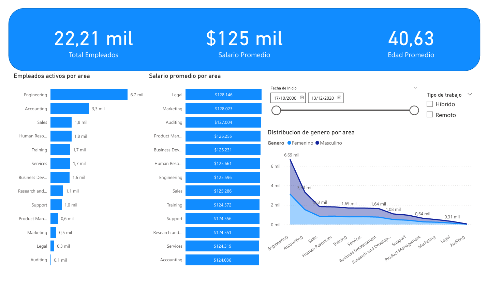

# 🧹 Proyecto SQL - Limpieza y Análisis de Datos de Empleados

Este proyecto tiene como objetivo aplicar conocimientos prácticos de **SQL** para limpiar, transformar y analizar una base de datos simulada de empleados. El trabajo final incluye un **dashboard en Power BI** que resume los hallazgos clave del análisis.

> ⚡ Este ejercicio me permitió demostrar mis habilidades técnicas en SQL, manejo de datos inconsistentes, creación de campos calculados y generación de reportes de valor para Recursos Humanos y áreas de negocio.

---

## 🎯 Objetivos del Proyecto

- Realizar una **limpieza estructurada de datos** utilizando SQL (MySQL).
- Detectar y eliminar duplicados, normalizar campos como salario, género y fechas.
- Crear **columnas calculadas** útiles como edad, años de servicio y correo corporativo.
- Explorar la base de empleados y obtener **insights clave** para el área de RRHH.
- Visualizar los resultados en un **dashboard profesional en Power BI**.

---

## 🔍 ¿Qué pude lograr con este análisis?

- Detectar inconsistencias de formato en fechas, salarios y género, y estandarizarlos.
- Eliminar duplicados y registros con errores para asegurar calidad en los reportes.
- Calcular métricas importantes como:
  - Edad promedio por área.
  - Empleados próximos a jubilarse.
  - Años de servicio por persona.
- Generar una **base de datos limpia y lista para análisis o migración**.
- Construir un **dashboard que podría ser utilizado por Recursos Humanos** o Business Intelligence.

---

## 🛠️ Herramientas utilizadas

- **SQL**: Limpieza, transformación y análisis de datos (MySQL).
- **Power BI**: Visualización y creación de KPIs interactivos.
- **Excel**: Para revisión previa y verificación cruzada.

---

## 📊 Dashboard (Power BI)

Incluye los siguientes KPIs y visualizaciones:

- ✅ Total de empleados activos
- 💰 Salario promedio general
- 🎂 Edad promedio de empleados
- 👨‍💼 Empleados activos por área
- 👩‍🔬 Distribución por género y área
- 🧮 Salario promedio por sector

📷 Vista del dashboard:

---

## 📁 Estructura del Proyecto
Limpieza-y-Análisis-de-Datos-1---SQL-y-PowerBI/
├── README.md                        # Documentación completa del proyecto
├── sql/
│   └── limpieza_empleados.sql      # Script SQL completo (13 etapas)
├── assets/
│   └── dashboard.png               # Captura del dashboard de Power BI
└── data/
    └── empleados_original.csv      # Datos crudos anonimizados (simulados)

---

## 🧠 Conocimientos aplicados

- Limpieza avanzada en SQL (TRIM, REPLACE, CASE, STR_TO_DATE).
- Conversión de tipos de datos (`VARCHAR`, `DATE`, `DECIMAL`).
- Identificación y remoción de duplicados.
- Cálculo de edad y antigüedad usando `TIMESTAMPDIFF`.
- Creación de campos útiles para RRHH como `email_corporativo`.
- Visualización e interpretación de métricas relevantes para la toma de decisiones.

---

## 💼 ¿Cómo puede aportar esto en un entorno laboral?

Este tipo de proyecto es fundamental en **procesos de migración de sistemas**, **auditoría de datos** o generación de informes automatizados para toma de decisiones. Saber transformar datos sucios en **información confiable y accionable** es una habilidad clave en:

- Business Intelligence
- Recursos Humanos
- Finanzas
- Analítica de datos

---

## 👨‍💻 Sobre mí

**Carlos Nazareno Rolón**  
Estudiante de Ingeniería en Sistemas · Apasionado por la analítica de datos y la eficiencia con SQL + IA  
📅 Fecha: Junio 2025

LinkedIn: www.linkedin.com/in/carlosnazarenorolon
Portafolio: 

---

## 📜 Licencia

Este proyecto es educativo y utiliza datos ficticios. Libre uso para aprendizaje o inspiración.
